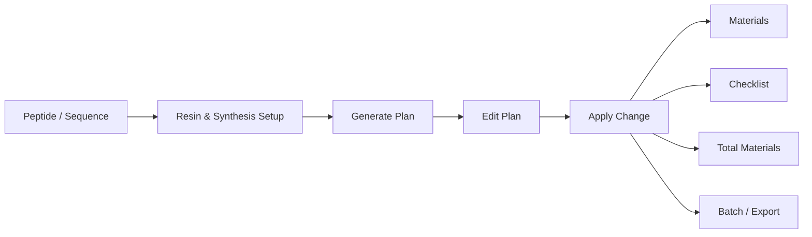

<div align="center">
  

# SPPS Planner V2.0.0

**A practical desktop workflow planner for Solid-Phase Peptide Synthesis (SPPS).**

Plan synthesis steps, calculate materials, manage repeat coupling rules, build checklists, and export batch-ready records from one desktop interface.

[](#)
[](#)
[](#)
[](#)
[](LICENSE)

**[한국어 README](README_KO.md)** · [Quick Start](#quick-start) · [Build](#build-for-windows) · [Repository Structure](#repository-structure)

</div>

---

## Overview

SPPS Planner V2.0.0 is a Windows desktop application designed to turn peptide synthesis settings into a structured, editable SPPS workflow.

Instead of managing sequence interpretation, reagent calculations, repeat coupling, washing steps, resin-specific behavior, and batch records separately, SPPS Planner keeps them connected through a single workflow:



The application is intended as a **research and planning aid**. Final synthesis conditions should always be reviewed by the user before experimental use.

---

## Highlights

### 🧬 Sequence-aware SPPS planning

- Supports amino acids and extended synthesis units including **natural AA, d-AA, chemicals, labels, tags, and linkers**.
- Handles sequence modifiers and chemical tokens used in practical peptide workflows.
- Uses **C-terminal position-based rules** consistently across supported synthesis units.

### 🔁 Flexible repeat coupling

Position rules can be entered as ranges or single positions:

```text
4-7:2
7:2
```

The value after `:` defines the number of coupling cycles.

Example for a 3× coupling step:

```text
Deprotection ×2
→ DMF wash ×6
→ Coupling 1
→ DMF wash ×2
→ Coupling 2
→ DMF wash ×2
→ Coupling 3
→ DMF wash ×2
→ Next synthesis step
```

Repeat coupling is reflected in the workflow and material calculations rather than being treated as a display-only flag.

### 🧪 Resin-aware workflow behavior

- `2-CTC` direct-loading behavior is preserved during `Apply Change`.
- `CTC(합성기)` follows full-sequence coupling behavior.
- Resin-dependent one-use volume preview updates **immediately when the Resin combobox selection changes**.
- Legacy `CTC(합성용)` saved values are normalized to `CTC(합성기)` and are not shown as a selectable resin.

### 🧾 Editable Plan + downstream synchronization

`Generate` and `Apply Change` are intentionally separated:

- **Generate** creates a new Plan from the current sequence and setup.
- **Apply Change** uses the currently edited Plan to update downstream outputs.

Edits can propagate to:

- Materials
- Checklist
- Total Materials
- Batch
- Export

### 🧴 Terminal chemistry handling

Final N-terminal deprotection is based on whether the terminal building block still carries a removable **N-terminal temporary protecting group such as Fmoc**.

Examples:

- Final `Fmoc-AA` / `Fmoc-d-AA` / Fmoc-protected AA-like building block → final deprotection is included.
- `Ac2O`, N-acetylated building blocks, `Biotin`, `FITC`, and other terminal materials without N-terminal Fmoc → no unnecessary final Fmoc deprotection.
- Side-chain acid-labile groups such as `Boc`, `OtBu`, `Pbf`, and `Trt` are not treated as N-terminal Fmoc protection.

### 🗂️ Custom material database

From `Project Manager → Show setup → Custom DB`, users can add, update, or delete custom entries for:

- AA / Chemical
- Coupling reagent
- Catalyst / additive
- Base
- Solvent
- Cleavage cocktail
- Resin
- Other materials

Custom entries are immediately available to the existing Plan and MW/density lookup workflow.

### 📦 Practical outputs

- Step-aligned Materials view
- Operational Checklist
- Total Materials summary
- Batch-oriented records
- CSV/XLSX export
- LOT information support

---

## Workflow Details

### Position rule fields

The following fields start **blank by default**:

- `AAs eq → C-term ranges`
- `Doubling → C-term ranges`

There is no placeholder or hidden default rule. Example syntax remains visible below the fields in the UI.

Supported syntax:

```text
1-3:1.5, 4-6:2
4-7:2
7:2
```

### Chemistry shortcut buttons

The buttons:

```text
Use DIC/HOBt
Use HBTU/NMP 10eq
```

change chemistry/default conditions only. They do **not** auto-generate preset Plan rows and do not rebuild an existing Plan simply by being clicked.

### Materials ordering

Materials are arranged according to the synthesis step order so that repeated coupling and intermediate washes remain aligned with the workflow instead of being detached and grouped at the end.

---

## Quick Start

### Requirements

- Windows
- Python **3.11 or 3.12**

### Run from source

```bat
python -m venv .venv
.venv\Scripts\activate
python -m pip install -r requirements.txt
python main_launcher.py
```

---

## Build for Windows

### Build EXE

```bat
BUILD_EXE_ONLY.bat
```

Expected output:

```text
dist\SPPS_Planner\SPPS_Planner.exe
```

### Build Installer

Install **Inno Setup 6 or 7**, then run:

```bat
BUILD_INSTALLER.bat
```

Expected output:

```text
installer\output\SPPS_Planner_Setup_V2.0.0.exe
```

For a first-time Windows build environment, the repository also includes:

```text
INSTALL_BUILD_TOOLS_AND_BUILD.bat
```

---

## Session & User Data

SPPS Planner can restore saved peptide items and user-defined database entries from its session data.

Depending on the workflow/version path used by the application, session files may be stored under user-local locations such as:

```text
%LOCALAPPDATA%\SPPS Planner\spps_planner_session_v1.json
```

or:

```text
%USERPROFILE%\.spps_planner\spps_planner_session_v1.json
```

Close the application before removing a session file. Runtime session data is excluded from Git tracking.

---

## Repository Structure

```text
SPPS-Planner/
├─ main_launcher.py                 # Application entry point
├─ suite_gui/                       # Desktop UI and workflow controllers
├─ apps/spps_planner_app/
│  ├─ spps_planner/                 # Parser, calculation, DB, export logic
│  └─ data/                         # Bundled reagent/process data
├─ tests/                           # V2.0.0 regression tests
├─ installer/                       # Inno Setup configuration
├─ docs/                            # Parser and DB schema documentation
├─ assets/                          # Application icons/assets
├─ BUILD_EXE_ONLY.bat
├─ BUILD_INSTALLER.bat
└─ requirements.txt
```

---

## Tests

Install development dependencies:

```bat
python -m pip install -r requirements-dev.txt
```

Set the project path and run the test suite:

```bat
set PYTHONPATH=%CD%\apps\spps_planner_app;%CD%
python -m pytest -q
```

The repository includes regression coverage for V2.0.0 behavior such as:

- 2-CTC direct loading preservation
- Apply Change synchronization
- Blank position-rule startup fields
- Single-position rules such as `7:2`
- N-repeat coupling
- Materials step ordering
- Resin live preview
- Terminal N-protection handling
- Custom DB behavior
- Chemistry preset buttons without Plan auto-generation

---

## Scope & Responsibility

SPPS Planner is a planning/calculation tool for research workflows. It does not replace experimental judgment, instrument SOPs, reagent specifications, safety procedures, or laboratory validation.

Always review generated quantities, sequence interpretation, protecting-group logic, resin chemistry, and synthesis steps before experimental execution.

---

## License

See [`LICENSE`](LICENSE).

This repository uses a **custom public academic citation license** and is **not presented as an OSI-approved open-source license**.

---

<div align="center">

**SPPS Planner V2.0.0**  
Built for practical peptide synthesis planning.

</div>
