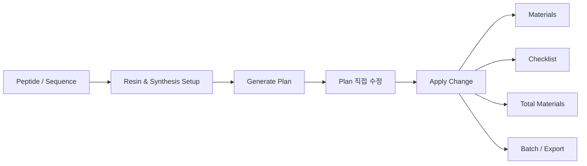

<div align="center">
  

# SPPS Planner V2.0.0

**고체상 펩타이드 합성(SPPS)을 실제 작업 흐름에 맞춰 계획·계산·정리하는 Windows 데스크톱 플래너**

Sequence 입력부터 Resin 설정, 반복 Coupling, Materials, Checklist, Total Materials, Batch, Export까지 하나의 흐름으로 연결합니다.

[](#)
[](#)
[](#)
[](#)
[](LICENSE)

**[English README](README.md)** · [빠른 시작](#빠른-시작) · [Windows 빌드](#windows-빌드) · [저장소 구조](#저장소-구조)

</div>

---

## 소개

SPPS Planner V2.0.0은 펩타이드 합성 조건을 **실제 작업 가능한 SPPS 공정 흐름**으로 정리하기 위한 데스크톱 프로그램입니다.

Sequence 해석, Resin 조건, coupling/deprotection/wash 단계, 반복 coupling, 시약 사용량, Checklist와 Batch 기록을 각각 따로 관리하지 않고 하나의 워크플로로 연결합니다.



본 프로그램은 **연구 및 합성 계획 보조 도구**입니다. 실제 실험 전에는 사용자가 최종 조건과 계산값을 반드시 검토해야 합니다.

---

## 핵심 기능

### 🧬 Sequence 기반 SPPS 계획

- Natural AA뿐 아니라 **d-AA, Chemical, Label, Tag, Linker**를 하나의 합성 unit 흐름으로 처리
- 실제 peptide workflow에서 사용하는 chemical/modifier token 인식
- C-terminus 기준 position rule을 지원되는 합성 unit에 일관되게 적용

### 🔁 원하는 횟수만큼 반복 Coupling

범위뿐 아니라 단일 위치도 지정할 수 있습니다.

```text
4-7:2
7:2
```

`:` 뒤 숫자가 실제 coupling 반복 횟수입니다.

예를 들어 `:3`이면:

```text
Deprotection ×2
→ DMF wash ×6
→ Coupling 1
→ DMF wash ×2
→ Coupling 2
→ DMF wash ×2
→ Coupling 3
→ DMF wash ×2
→ 다음 합성 단계
```

단순히 `Repeat=3`이라고 표시만 하는 것이 아니라 **실제 공정 단계와 재료 계산에 반복 횟수가 반영**됩니다.

### 🧪 Resin별 공정 처리

- `2-CTC` direct loading 상태가 `Apply Change` 이후에도 보존
- `CTC(합성기)`는 입력 Sequence 전체 coupling 방식 유지
- Resin combobox에서 Resin을 선택하는 **즉시** `Current 1-use mL` preview 갱신
- 과거 저장값 `CTC(합성용)`은 `CTC(합성기)`로 정규화되며 선택 목록에는 표시하지 않음

### 🧾 Plan 직접 수정 + Apply Change 동기화

`Generate`와 `Apply Change`는 역할이 분리되어 있습니다.

- **Generate**: 현재 Sequence/Setup을 기준으로 새 Plan 생성
- **Apply Change**: 현재 사용자가 편집한 Plan을 기준으로 후속 결과 갱신

Plan 변경 사항은 다음으로 연결됩니다.

- Materials
- Checklist
- Total Materials
- Batch
- Export

### 🧴 최종 N-term 보호기 처리

마지막 deprotection 여부는 단순히 “AA인가?”가 아니라, **최종 N-term에 결합된 building block에 제거해야 하는 N-terminal temporary protecting group(Fmoc 등)이 남아 있는지**를 기준으로 판단합니다.

예:

- 최종 `Fmoc-AA`, `Fmoc-d-AA`, Fmoc-protected AA-like building block → 마지막 deprotection 포함
- `Ac2O`, N-acetylated building block, `Biotin`, `FITC` 등 N-terminal Fmoc가 없는 terminal material → 불필요한 최종 Fmoc deprotection 없음
- `Boc`, `OtBu`, `Pbf`, `Trt` 같은 acid-labile side-chain protecting group은 N-terminal Fmoc 판단 대상이 아님

### 🗂️ Custom DB

`Project Manager → Show setup → Custom DB`에서 사용자 재료를 직접 관리할 수 있습니다.

지원 분류:

- AA / Chemical
- Coupling reagent
- Catalyst / additive
- Base
- Solvent
- Cleavage cocktail
- Resin
- Other

사용자가 추가한 항목은 기존 Plan 및 MW/Density lookup에 바로 사용할 수 있습니다.

### 📦 실무형 결과물

- 실제 Step 순서에 맞춘 Materials
- 작업용 Checklist
- Total Materials 집계
- Batch 기록
- CSV/XLSX Export
- LOT 정보 지원

---

## 공정 규칙

### Position rule 입력칸

다음 두 입력칸은 프로그램 시작 시 **완전히 빈칸**입니다.

- `AAs eq → C-term ranges`
- `Doubling → C-term ranges`

Placeholder가 없으며, 숨겨진 기본 규칙도 자동 적용되지 않습니다. UI 아래의 Example 문구만 참고용으로 유지됩니다.

지원 형식:

```text
1-3:1.5, 4-6:2
4-7:2
7:2
```

### Chemistry shortcut 버튼

```text
Use DIC/HOBt
Use HBTU/NMP 10eq
```

두 버튼은 chemistry/default 조건만 변경합니다.

버튼을 누르는 것만으로:

- Plan preset 행을 자동 생성하지 않음
- 기존 Plan을 임의로 다시 만들지 않음

### Materials 순서

Materials는 실제 합성 Step 순서를 따라 배치됩니다.

반복 coupling의 재료와 중간 DMF wash가 뒤에 따로 몰리지 않고:

```text
Deprotection
→ DMF wash
→ Coupling 1
→ DMF wash
→ Coupling 2
→ DMF wash
→ 다음 unit
```

순서로 공정 흐름과 맞춰집니다.

---

## 빠른 시작

### 권장 환경

- Windows
- Python **3.11 또는 3.12**

### 소스에서 실행

```bat
python -m venv .venv
.venv\Scripts\activate
python -m pip install -r requirements.txt
python main_launcher.py
```

---

## Windows 빌드

### EXE 생성

```bat
BUILD_EXE_ONLY.bat
```

생성 위치:

```text
dist\SPPS_Planner\SPPS_Planner.exe
```

### Installer 생성

**Inno Setup 6 또는 7** 설치 후:

```bat
BUILD_INSTALLER.bat
```

생성 위치:

```text
installer\output\SPPS_Planner_Setup_V2.0.0.exe
```

처음 Windows 빌드 환경을 구성할 때 사용할 수 있는 스크립트도 포함되어 있습니다.

```text
INSTALL_BUILD_TOOLS_AND_BUILD.bat
```

---

## 세션 및 사용자 데이터

SPPS Planner는 peptide items와 Custom DB 등 사용자 데이터를 세션에서 복원할 수 있습니다.

환경/실행 경로에 따라 다음과 같은 사용자 영역의 세션 파일을 사용할 수 있습니다.

```text
%LOCALAPPDATA%\SPPS Planner\spps_planner_session_v1.json
```

또는:

```text
%USERPROFILE%\.spps_planner\spps_planner_session_v1.json
```

세션 파일을 초기화할 때는 프로그램을 먼저 종료하십시오. Runtime session 데이터는 Git 추적 대상에서 제외됩니다.

---

## 저장소 구조

```text
SPPS-Planner/
├─ main_launcher.py                 # 프로그램 실행 진입점
├─ suite_gui/                       # Desktop UI / workflow controller
├─ apps/spps_planner_app/
│  ├─ spps_planner/                 # Parser / 계산 / DB / Export
│  └─ data/                         # 기본 reagent / process 데이터
├─ tests/                           # V2.0.0 회귀 테스트
├─ installer/                       # Inno Setup 설정
├─ docs/                            # Parser / DB schema 문서
├─ assets/                          # 프로그램 아이콘 및 asset
├─ BUILD_EXE_ONLY.bat
├─ BUILD_INSTALLER.bat
└─ requirements.txt
```

---

## 테스트

개발용 의존성 설치:

```bat
python -m pip install -r requirements-dev.txt
```

프로젝트 경로 설정 후 전체 테스트:

```bat
set PYTHONPATH=%CD%\apps\spps_planner_app;%CD%
python -m pytest -q
```

V2.0.0 회귀 테스트에는 다음과 같은 핵심 동작 검증이 포함되어 있습니다.

- 2-CTC direct loading 보존
- Apply Change 연동
- Position rule 입력칸 blank startup
- `7:2` 단일 위치 규칙
- N회 반복 coupling
- Materials step 순서
- Resin 선택 즉시 preview 갱신
- 최종 N-terminal temporary protection 처리
- Custom DB
- Chemistry preset 버튼의 Plan 자동생성 방지

---

## 사용 범위 및 주의사항

SPPS Planner는 연구용 합성 계획 및 계산을 돕는 도구입니다.

실제 실험에서는 반드시 다음을 사용자가 최종 검토해야 합니다.

- Sequence / modifier 해석
- Resin chemistry
- Protecting-group strategy
- Reagent equivalents와 사용량
- Wash / deprotection / coupling step
- Cleavage 조건
- 장비 SOP 및 실험실 안전 절차

프로그램 결과만을 근거로 검증 없이 실험 조건을 확정하는 용도로 사용하지 마십시오.

---

## 라이선스

[`LICENSE`](LICENSE)를 확인하십시오.

본 저장소는 **사용자 정의 Public Academic Citation License**를 사용하며, **OSI 승인 오픈소스 라이선스로 표기하지 않습니다.**

---

<div align="center">

**SPPS Planner V2.0.0**  
실제 펩타이드 합성 흐름을 더 명확하게 계획하기 위해.

</div>
